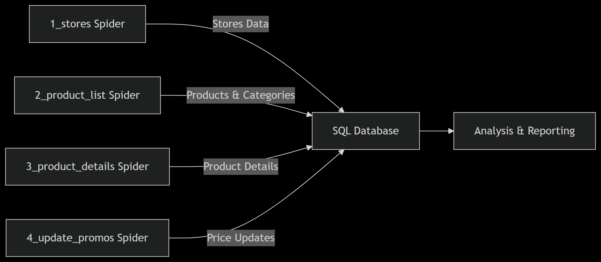

# Despar e-Commerce Scraper

This Scrapy project scrapes store information, product catalogs, and product details from Despar online stores.

## Table of Contents
- [Project Structure](#project-structure)
- [Data Outputs](#data-outputs)
- [Core Spiders](#core-spiders)
- [Key Endpoints](#key-endpoints)
- [Installation](#installation)
- [How to Run](#how-to-run)
  - [1. Scrape Store Locations](#1-scrape-store-locations)
  - [2. Scrape Product Catalog](#2-scrape-product-catalog)
  - [3. Scrape Product Details](#3-scrape-product-details)
  - [Customization Options](#customization-options)
- [Output Samples](#output-samples)
  - [Store Item](#store-item)
  - [Product Category Item](#product-category-item)
  - [Product List Item](#product-list-item)
  - [Product Promo Item](#product-promo-item)
- [Recommended Improvements](#recommended-improvements)


## Project Structure
```text
despar_scraper/
├── spiders/
│   ├── 1_stores.py        # Scrapes store locations
│   ├── 2_product_list.py  # Scrapes categories and product listings
│   └── 3_product_details.py # Scrapes product details
├── items.py               # Data structure definitions
├── pipelines.py           # Data processing pipeline
└── settings.py            # Scrapy configuration
```

## Data Outputs
```
data/
├── json/
│   ├── stores.json          # Store locations data
│   ├── categories.json      # Product categories
│   ├── product_list.json    # Basic product info
│   ├── promos.json          # Promotion details
│   └── product_details.json # product details
├── csv/
│   └── stores.csv           # Store locations (CSV format)
└── log/                     # Spider execution logs
│   ├── stores.log           # execution logs
│   ├── product_list.log     # execution logs
│   ├── product_details.log  # execution logs
```

## Core Spiders
1. **Store Information Spider** (`1_stores.py`)
   - Collects physical store locations and delivery zones
   - Extracts geo-coordinates, addresses, and service types

2. **Product Catalog Spider** (`2_product_list.py`)
   - Scrapes category hierarchies and product listings
   - Captures pricing, brands, and promotional data

3. **Product Details Spider** (`3_product_details.py`)
   - Gathers product descriptions and image URLs
   - Extracts technical specifications and attributes


## Key Endpoints
- Store locator: `https://{domain}/spesa-ritiro-negozio/{store_slug}`
- Home delivery: `https://{domain}/spesa-consegna-domicilio/{zip_code}`
- Category page: `{store_url}/{category_slug}`
- Product page: `{store_url}/prodotto/{product_id}`
- Product API: `{store_url}/ajax/productsPagination`


## Installation
```bash
pip install scrapy
```

## How to Run

### 1. Scrape Store Locations
Scrapes physical stores and delivery zones:
```bash
# For main domain:
scrapy crawl 1_stores -a store="https://shop.despar.com"

# For Sicilia domain:
scrapy crawl 1_stores -a store="https://shop.desparsicilia.it"
```

### 2. Scrape Product Catalog
Scrapes categories, products, and promotions:
```bash
# Scrape all stores with first 5 categories each:
scrapy crawl 2_product_list -a category_limit=5

# Scrape first 2 stores only:
scrapy crawl 2_product_list -a store_limit=2
```

### 3. Scrape Product Details
Scrapes images and descriptions:
```bash
# Scrape details for first 100 products:
scrapy crawl 3_product_details -a product_limit=100
```

### Customization Options
| Spider             | Arguments          | Description                          |
|--------------------|--------------------|--------------------------------------|
| `1_stores`         | `store`            | Target store domain (required)       |
| `2_product_list`   | `store_limit`      | Max stores to process (0=all)        |
|                    | `category_limit`   | Max categories per store (0=all)     |
|                    | `store_list_file`  | Stores json file (`data/json/stores.json`) |
| `3_product_details`| `product_limit`    | Max products to scrape (0=all)       |
|                    | `product_list_file`| Product List json file (`data/json/product_list.json`) |


## Output Samples
### Store Item:
```json
{
    "pk": "https://shop.despar.com;spesa-ritiro-negozio;corato-interspar-via-gravina-62;33774",
    "domain": "https://shop.despar.com",
    "type_": "spesa-ritiro-negozio",
    "slug": "corato-interspar-via-gravina-62",
    "id_": "33774",
    "name": "Corato, Interspar via Gravina 62",
    "address": "Corato, Interspar via Gravina 62 - Corato",
    "lat": 41.139118,
    "long": 16.415059,
    "city_id": 2322,
    "city_name": "Corato",
    "province_id": "9",
    "province_name": "Bari",
    "url": "https://shop.despar.com/spesa-ritiro-negozio/corato-interspar-via-gravina-62"
}
```

### Product Category Item:
```json
{
    "main_category": "Frutta e Verdura",
    "sub_category": "Frutta",
    "sub_category_slug": "frutta_277",
    "sub_category_id": "277",
    "category": "Agrumi",
    "category_slug": "agrumi_310",
    "category_id": "310",
    "category_hierarchy": "Frutta e Verdura > Frutta > Agrumi",
    "store_pk": "https://shop.despar.com;spesa-ritiro-negozio;corato-interspar-via-gravina-62;33774"
}
```

### Product List Item:
```json
{
    "id_": "233881",
    "name": "YOGURT DA BERE S/LAT. MILA 200G FRAGOLA",
    "brand": "",
    "price": "0,85",
    "old_price": "",
    "meta": "0,20 kg - 4,25 € al kg",
    "icons": [
        "Senza Glutine",
        "Senza Lattosio"
    ],
    "img": "https://restorecms.blob.core.windows.net/mai/products/images/assets/300x300x75/233881.jpg",
    "category_id": "267",
    "category_hierarchy": "Latte e Latticini > Yogurt e dessert > Yogurt e probiotici",
    "store_pk": "https://shop.despar.com;spesa-ritiro-negozio;corato-interspar-via-gravina-62;33774",
    "url": "https://shop.despar.com/spesa-ritiro-negozio/corato-interspar-via-gravina-62/prodotto/233881"
}
```

### Product Promo Item:
```json
{
    "product_id": "233848",
    "type_": "discount",
    "value": "-7%",
    "end_date": "fino al 08/06",
    "store_pk": "https://shop.despar.com;spesa-ritiro-negozio;corato-interspar-via-gravina-62;33774"
}
```

## Recommended Improvements

1. Run spiders sequentially (stores → product list → details)

2. Add validations and processing to the data in the [Pipeline](despar_scraper/pipelines.py) to match the other projects

3. Make SQL pipeline to save the data into a DataBase (using SQLAlchemy or raw SQL)

4. Make a `4_price_update` spider for regular use, input `categories.json` and get all ( prices and promotions only )

5. Example
    